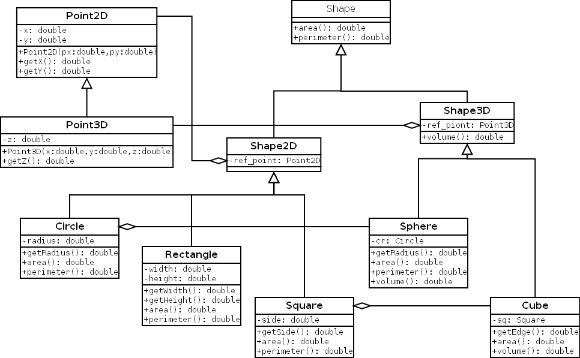

# GeoEx
An example class hierarchy of geometry figures in 2D and 3D including *circle*, *rectangle*, *square*, *cube* and *sphere*.

## Classes
The example consist of the following classes in hierarchical order:
* `Point2D` (Two dimensional space point)
  * `Point3D` (Three dimensional space point)
* `Shape` (Generic shape)
  * `Shape2D` (Two dimensional shapes)
    * `Circle`
    * `Rectangle`
    * `Square`
  * Shape3D (Three dimensional bodies)
    * `Cube`
    * `Sphere`

Classes `Shape2D` and `Shape3D` aggregate a reference point as `Point2D` and `Point3D` respectively. Classes for three dimensional bodies aggregate their base two dimensional shape, so `Cube` aggregates a `Square` and `Sphere` aggregates a `Circle`.

## Methods

Two dimensional shapes implement `area` and `perimeter` methods while three dimensional bodies does not implement `perimeter`, but implement `volume`.

## UML diagram

